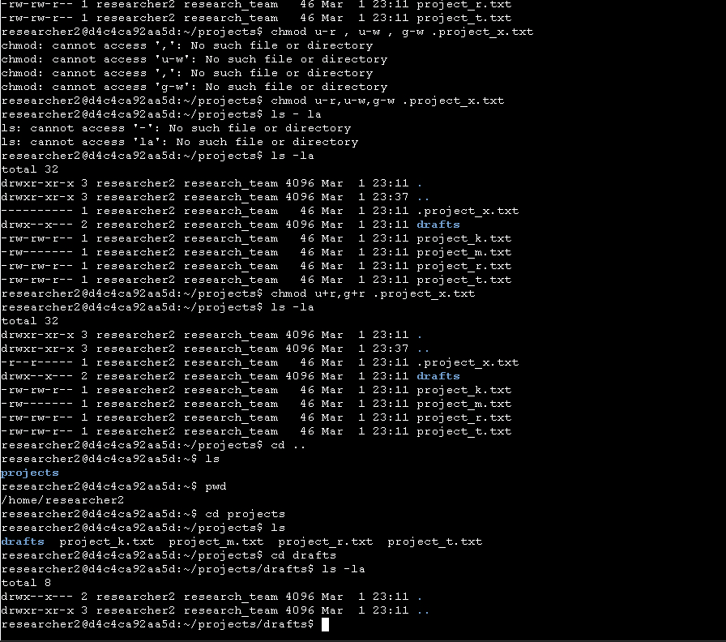
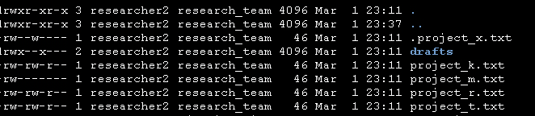

# 🔐 Linux Permissions Management

Managing Linux file and directory permissions using `ls -la` and `chmod` to enforce the **Principle of Least Privilege**.

---

## 📌 Overview

This project demonstrates how to inspect and modify Linux file and directory permissions to strengthen system security and reduce unauthorized access.

---

## 🔎 Inspecting Permissions

To review file permissions and hidden files:

```bash
ls -la
```

This command displays:

- File type
- User permissions
- Group permissions
- Other permissions
- Hidden files
- File ownership details

---

## 🧩 Understanding the Permission String

Example:

```bash
-rw-rw-r--
```

### Breakdown

- 1st character → File type (`-` = file, `d` = directory)
- 2–4 → User permissions
- 5–7 → Group permissions
- 8–10 → Other permissions

### Permission Symbols

- `r` = read  
- `w` = write  
- `x` = execute  
- `-` = no permission  

---

## 🔐 Securing Files

### Removed write access from others:

```bash
chmod o-w project_k.txt
```

### Restricted sensitive file to owner only:

```bash
chmod g-rw project_m.txt
```

### Secured hidden archived file:

```bash
chmod 444 .project_x.txt
```

---

## 📂 Securing Directory Access

Removed execute permission from group to restrict directory access:

```bash
chmod g-x drafts
```

This ensures only the owner can access the directory and its contents.

---

## 🛡 Security Concepts Applied

- Access Control
- Least Privilege Principle
- File Permission Auditing
- Hidden File Management
- Directory Execute Control

---
---

## 📸 Lab Screenshots

### Permission Listing Output


### Hidden File Permission Update

## ✅ Summary

This lab strengthened practical Linux security skills by identifying insecure permissions and applying corrective actions using `chmod`.

Understanding and managing file permissions is a foundational skill in cybersecurity and system hardening.
